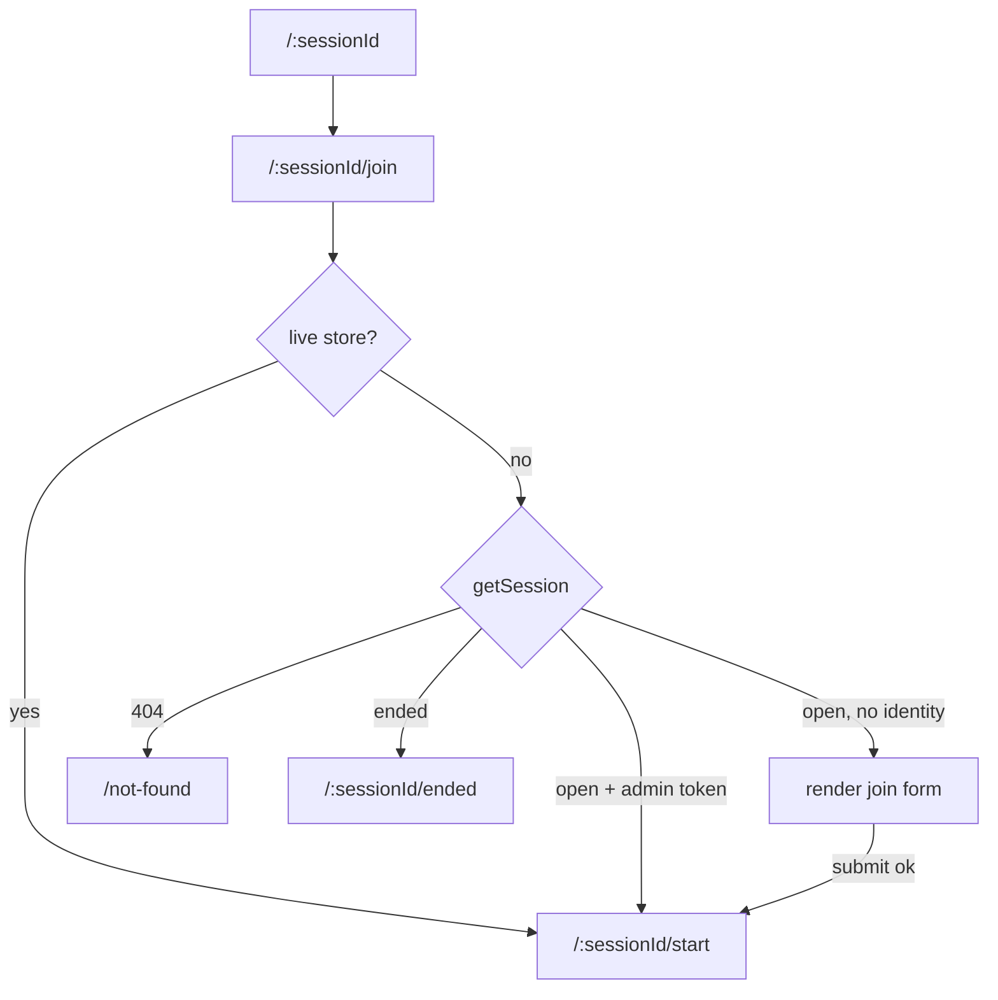
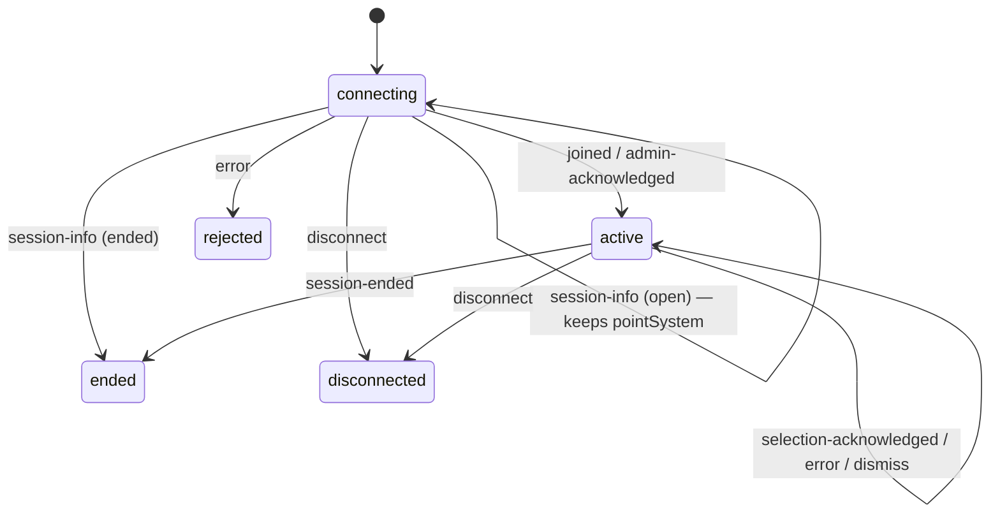
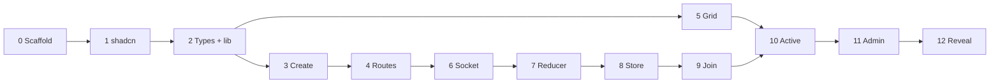

# Estimator Frontend — Implementation Plan

`estimator-plan.md` specifies the product and every resolved decision. This
document covers only the frontend build: what gets built, in what order, and how
you know a phase is finished.

Terms used here are defined in [`CONTEXT.md`](./CONTEXT.md).

**The visual layer is a separate document.** This plan built the app's structure
and behaviour; [`DESIGN.md`](./DESIGN.md) is the Fold and Flip design, and
[`docs/plans/fold-and-flip.md`](./docs/plans/fold-and-flip.md) sequences its
build in Stages 0–10. That document counts *Stages* so its numbering never
collides with the Phases below.

**Out of scope**: deployment config (`vercel.json`, env vars, CORS bootstrap).
That is a separate pass once both apps ship together, the same way the backend
kept `render.yaml` out of its own plan.

**Also out of scope**: automated tests. Verification is by hand, per phase.

---

## Deviations from `estimator-plan.md`

That document is unchanged. Where this plan differs:

| It says | This plan does | Why |
| --- | --- | --- |
| 2 routes, one `SessionPage` that branches on status | 5 flat routes, each with a loader | A branching view is a router in disguise — see `separate-views-from-routing` |
| `useAdminToken` hook | `lib/adminToken.ts`, plain functions | Loaders cannot call hooks |
| `useSessionSocket` owns the socket | `lib/socket.ts` → store → `useSessionConnection` | Keeps `socket.io-client` in one file |
| Grid rows ascending | Rows reversed — highest Resources at top | Miro wireframe, both screens |
| Plain grid cells | Grey when empty, green for your own Selection, a colour per person on the Reveal | Miro wireframe, then [reveal-colours-and-create-gating.md](docs/features/reveal-colours-and-create-gating.md) |
| No app title | "Product Poker" header on every page | Miro shows a title on all three screens |
| Vitest + React Testing Library | No tests | Scoped out |
| — | One shared parent, `RootLayout`, wraps every route | Somewhere to show the loading notice on every page. It holds no Session state |
| — | A first-load screen: header plus loading notice | The loading notice only covers moves between pages, not the first page load, which is where most cold starts happen |

Renamed from the Miro wireframe's "Task estimator" to avoid confusion with the
out-of-scope task-description feature.

### Reversed by the Fold and Flip design

The visual redesign in [`DESIGN.md`](./DESIGN.md), sequenced in
[`docs/plans/fold-and-flip.md`](./docs/plans/fold-and-flip.md), reverses two of
`estimator-plan.md`'s resolved decisions outright:

| # | It says | The design does | Where |
| --- | --- | --- | --- |
| 16 | Mobile/responsive out of scope, desktop-only, no breakpoints | Three breakpoints; every screen drawn at 390 / 834 / 1440 | `DESIGN.md` §5 |
| 18 | Grid is click/tap only — no `tabIndex`, arrow keys or ARIA roles | Roving `tabIndex`, arrow keys, Enter/Space, an `aria-label` per Square | `DESIGN.md` §6 |

Also note: the "a colour per person on the Reveal" row above is superseded. A
revealed Square is now filled from the crowd ramp by headcount, with names in a
popover.

---

## How it fits together

```
┌──────────┐   POST /sessions      ┌─────────┐
│ Browser  │ ────────────────────► │ Backend │
│          │   GET /sessions/:id   │ Express │
│          │ ◄──────────────────── │  + S.IO │
│          │                       │         │
│          │   Socket.IO           │         │
│          │ ◄───────────────────► │         │
└──────────┘                       └─────────┘
```

- REST answers "does this Session exist, has it ended" once, at page entry.
- The socket carries everything live: joining, choosing a Square, the Reveal.
- An ended Session never opens a socket. REST already has the whole Reveal.

---

## Layers

Each layer talks only to the one below it.

```
route component  ──►  hook  ──►  store / registry  ──►  lib/socket.ts  ──►  socket.io-client
loader / action  ──────────────────────────────────►  lib/*
```

- `lib/socket.ts` is the only file importing `socket.io-client`.
- `lib/adminToken.ts` is the only file touching `localStorage`.
- Loaders and actions call `lib/` directly. They cannot use hooks.
- Components never reach past their hook.

---

## Routes

Every Session status is a real route, so it can be bookmarked, refreshed and
linked. No component anywhere maps a status to a screen.

| Path | Page | Loader decides |
| --- | --- | --- |
| `/` | — | Always redirects to `/welcome` |
| `/welcome` | `WelcomePage` | — |
| `/new` | `CreateSessionPage` | — |
| `/:sessionId` | — | Always redirects to `/join` |
| `/:sessionId/join` | `JoinSessionPage` | Unknown → `/not-found`, ended → `/ended`, already connected → `/start` |
| `/:sessionId/start` | `ActiveSessionPage` | Unknown → `/not-found`, ended → `/ended`, no identity → `/join` |
| `/:sessionId/ended` | `EndedPage` | Unknown → `/not-found`, still open → `/start` or `/join` |
| `/not-found` | `NotFoundPage` | — |
| `*` | — | Redirects to `/not-found` |

Flat: no route nests inside another. They share one parent, `RootLayout`, which
only shows the loading notice. It holds no Session state, so a live connection
still can't rely on it surviving a page change.

**Every loader calls `getSession()` first**, unless a live store already exists
for that Session. Checking the Admin token first would send an Admin holding a
token for a restarted server to `/start`, where the socket is refused and a
reload does the same thing again — they could never reach `/not-found`.



### Cold starts

Render's free tier sleeps after 15 minutes without HTTP traffic. Sporadic use
means most Sessions start cold, so the first `getSession()` can take 30–60
seconds. That is the normal path, not an edge case.

- An `errorElement` just under the root catches a failed loader and offers a
  retry, with the header still showing. It says
  "Could not reach the server" only when that is true. `lib/api.ts` throws a
  `NetworkError` for that case, separate from a server error or a code bug.
- `useNavigation()` drives a loading notice, so the wait is never a blank page.
  It waits 400ms before showing, so a fast page change doesn't flash it.
- The first page load shows the header and the same notice until the loader
  finishes.
- Submit buttons disable while a loader or action runs.

---

## Connection state

Four statuses, all of them things only observable after a page has settled.
Loading, not-found and needs-a-name were already resolved by a loader.



`active`, `rejected`, `disconnected` and `ended` are terminal apart from
`active`'s self-transitions. A fresh connection is the only way out.

```ts
// src/constants.ts
export const SessionConnectionStatus = {
  CONNECTING: "connecting",
  ACTIVE: "active",
  REJECTED: "rejected",
  DISCONNECTED: "disconnected",
  ENDED: "ended",
} as const;

export const SessionAction = {
  SESSION_INFO_RECEIVED: "sessionInfoReceived",
  IDENTITY_ACKED: "identityAcked",
  SELECTION_ACKED: "selectionAcked",
  ERROR_RECEIVED: "errorReceived",
  ERROR_DISMISSED: "errorDismissed",
  DISCONNECTED: "disconnected",
  SESSION_ENDED: "sessionEnded",
} as const;
```

```ts
// src/types/session.ts
export interface SessionError {
  code?: ErrorCode;
  message: string;
}

export type SessionConnectionState =
  | { status: typeof SessionConnectionStatus.CONNECTING; pointSystem: PointSystem | null }
  | {
      status: typeof SessionConnectionStatus.ACTIVE;
      pointSystem: PointSystem;
      selection: Selection | null;
      error: SessionError | null;
      isAdmin: boolean;
    }
  | { status: typeof SessionConnectionStatus.REJECTED; error: SessionError }
  | { status: typeof SessionConnectionStatus.DISCONNECTED }
  | { status: typeof SessionConnectionStatus.ENDED };
```

### Why `connecting` holds a nullable point system

Rendering needs two server messages, so no single action carries everything.

| Message | Carries |
| --- | --- |
| `session-info` | `pointSystem`, `ended` — sent on connect, before any join |
| `joined` | `participantId`, `name` |
| `admin-acknowledged` | `participantId`, `name`, `selection` |

`session-info` is the only message carrying `pointSystem`, so `connecting` holds
it until an identity ack widens the state to `active`. A null at that point is a
protocol violation, not a real case — treat it as unreachable.

`session-info` also carries `ended`, which covers decision #22b: a socket
connecting as the Session ends is admitted and told so, rather than refused. It
goes straight to `ended` through the same branch as any other ended Session.

### Why `rejected` is separate

`connecting` has nowhere to put an error, and moving to `active` would claim a
join worked when it did not. Both triggers are ordinary:

- `INVALID_NAME` fires on anything failing `/^[A-Za-z0-9]+( [A-Za-z0-9]+)*$/` at up
  to 20 characters — "Jim@Bob". Spaces are fine; other symbols are not.
- `UNKNOWN_SESSION` fires when the backend restarts between the loader's
  `getSession()` and the user pressing submit.

### Why `disconnected` is separate

`reconnection: false` exists so a dropped connection re-prompts for a name
instead of silently resuming. That only works if the drop is noticed. Without
this state a Participant keeps clicking Squares into a dead socket, sees no
feedback, and lands in Abstained believing they took part.

### Terminal states ignore `disconnected`

`UNKNOWN_SESSION` emits its error and *then* closes the socket. Without the
guard, `rejected`'s message would be wiped by a state carrying none.

The server does **not** close the socket after `session-ended`. The store closes
it on reaching a terminal state, which fires a local `disconnect` the guard then
absorbs. A later server restart would otherwise drag a tab sitting on `ended`
back to `/join`.

### Applying an acknowledged Selection

`selection-acknowledged` echoes the requested Square, not the resulting
Selection — so choosing (3,5) and clearing (3,5) look identical on the wire. The
client re-applies the same toggle the server used.

```ts
// in the ACTIVE branch
const { square } = action;
const isSame =
  state.selection?.time === square.time &&
  state.selection?.resource === square.resource;

return { ...state, selection: isSame ? null : square, error: null };
```

Safe because Socket.IO preserves order on one connection and this app never
applies an optimistic update — `selection` only ever moves on a server
acknowledgement. So the client is never ahead of the server, and the stale-click
race has nothing to roll back.

This duplicates decision #10's rule across two repos. Accepted rather than
widening the backend ack to `{ selection }`, which is the cleaner protocol but
means changing a shipped repo for four lines. Revisit if a third client needs it.

---

## Keeping the connection across a navigation

The connection opened by `/join`'s action has to survive the move to `/start`.
Re-joining there would create a second Participant.

```ts
// src/lib/sessionConnectionRegistry.ts
interface SessionConnectionStore {
  getSnapshot: () => SessionConnectionState;
  subscribe: (listener: () => void) => () => void;
  whenSettled: () => Promise<SessionConnectionState>; // resolves once it leaves CONNECTING
  select: (time: number, resource: number) => void;
  dismissError: () => void;
  endSession: () => void;
  close: () => void;
}

const registry = new Map<string, SessionConnectionStore>();

export function getOrCreateSessionConnection(
  sessionId: string,
  identity: { name: string } | { adminToken: string },
): SessionConnectionStore;

export function peekSessionConnection(sessionId: string): SessionConnectionStore | undefined;

// Closes the socket, then drops the entry. Closing matters — dropping
// the entry alone leaks a live socket.
export function removeSessionConnection(sessionId: string): void;
```

Called from exactly two places, both of which run once per entry rather than on
every render:

- `startLoader` — creates the Admin's store from a stored token.
- `joinAction` — creates a Participant's store from a name.

Eviction is deliberately not automatic on reaching a terminal state. A store
that evicted itself would be rebuilt by the next `getOrCreate`, and a failing
connection would spin. Stores for finished Sessions stay in the map; the leak is
bounded by the tab's lifetime.

### Reading it

```ts
// src/hooks/useSessionConnection.ts
function useSessionConnection(sessionId: string): SessionConnection {
  const store = peekSessionConnection(sessionId)!; // the loader guarantees this
  const state = useSyncExternalStore(store.subscribe, store.getSnapshot);

  return {
    state,
    isAdmin: getAdminToken(sessionId) !== null,
    select: store.select,
    dismissError: store.dismissError,
    endSession: store.endSession,
  };
}
```

No fork inside the hook — the loader already created the store, so this only
reads.

**Changed from the first draft.** The plan originally used `useState` plus
`useEffect` here. The build uses `useSyncExternalStore`, React's built-in way to
read from something outside React. In plain terms: React asks the store for its
current value on every render and re-renders when the store says it changed, so
the page can never show an out-of-date value. It is also shorter. It is safe
because the store's value only changes when something real happens.

The hook also hands back `isAdmin` and the store's commands, not just the state,
so a page gets everything it needs from one call.

### Navigating on a status change

```tsx
function ActiveSessionPage() {
  const { sessionId } = useParams();
  const { state, isAdmin } = useSessionConnection(sessionId!);

  const lost =
    state.status === SessionConnectionStatus.DISCONNECTED ||
    state.status === SessionConnectionStatus.REJECTED;

  if (state.status === SessionConnectionStatus.ENDED) {
    return <Navigate to={`/${sessionId}/ended`} replace />;
  }

  // A dropped Participant goes back for a new name. An Admin does not —
  // /join would see their token and send them straight back here.
  if (lost && !isAdmin) {
    return <Navigate to={`/${sessionId}/join`} replace />;
  }

  if (state.status === SessionConnectionStatus.CONNECTING) return <Loader />;
  if (lost) return <ConnectionLost />;

  return <ActiveSessionView state={state} />;
}
```

Rendering `<Navigate>` rather than calling `navigate()` in an effect — the
redirect is part of what this page renders for that status, not a side effect.

`ConnectionLost` is a static "reload to reconnect" message. No retry button and
no auto-reconnect, both of which would loop against a backend that is down.

### The Back button

Going back from `/start` must not create a second Participant. Two things stop it:

- `/join`'s loader redirects to `/start` when `peekSessionConnection` finds a
  store that is not terminal.
- `joinAction` calls `removeSessionConnection` before creating a new store, so a
  genuine re-join after a drop still gets a live socket rather than the dead one.

---

## The grid

Time runs left to right. Resources runs bottom to top, highest at the top.
Origin sits bottom-left, like an ordinary chart.

```
Resources
    8 │   ·       ·       ·       ·
    4 │   ·     James     ·       ·
    2 │   ·     Mary      ·     John
      │                         Jim
    0 │   ·       ·       ·       ·
      └────────────────────────────────
          0       2       4       8     Time
```

Axis values stay ascending everywhere — that is the server's shape and the wire
format. Only the rows are reversed, and only at render.

```tsx
const rows = [...axisValues].reverse(); // Resources, high at top
const cols = axisValues;                // Time, low at left
```

`selection.resource` is always an axis value, never a row index. Never flip it.

### Square states

`DESIGN.md` §6 is the reference; `utils/grid.ts` implements it.

| Mode | Condition | Fill | Face |
| --- | --- | --- | --- |
| interactive | your Selection | `selection` | "You" / ★ |
| interactive | inside your Selection's Area | `crowd-1` | — |
| interactive | otherwise | `crowd-0` | — |
| readonly | by headcount, capped at 4 | `crowd-0`…`crowd-4` | name, or "N people" / "×N" |

Hover (mouse) and keyboard focus lift the Square and show a one-line
tooltip. With a mouse on the running grid, the hovered Area gets an `accent`
overlay. On the Reveal, clicking a Square someone landed on pins a popover
listing every name; the same Square or Esc closes it. Touch gets no hover.
Squares are sized by breakpoint (§5), floored at `SQUARE_MIN_PX`, and a grid
too wide for that scrolls sideways. See [grid-area.md](docs/features/grid-area.md).

```ts
// src/components/EstimationGrid.tsx — prop types stay local
interface EstimationGridProps {
  axisValues: number[];
  mode: GridMode;
  selection?: Selection | null;
  reveal?: RevealPayload;
  onSelect?: (selection: Selection) => void;
}
```

Roving `tabIndex`: one Tab stop, arrows move, Enter/Space presses. Decision #18
is reversed — see "Reversed by the Fold and Flip design".

---

## Socket layer

```ts
// src/lib/socket.ts — the only file importing socket.io-client
export const WebSocketEvent = {
  Join: "join",
  AdminAuthenticate: "admin-auth",
  SelectSquare: "select-square",
  EndSession: "end-session",
  SessionInfo: "session-info",
  Joined: "joined",
  AdminAcknowledged: "admin-acknowledged",
  SelectionAcknowledged: "selection-acknowledged",
  SessionEnded: "session-ended",
  Error: "error",
} as const;

export function createSocket(sessionId: string): AppSocket {
  return io(import.meta.env.VITE_SOCKET_URL, {
    reconnection: false,
    query: { sessionId },
  });
}
```

Event names and payload maps are hand-mirrored from the backend's
`src/ws/events.ts`, with a comment pointing at it. A typo then fails to compile
instead of silently never firing.

`reconnection: false` is deliberate — a blip re-prompts for a name rather than
silently resuming.

The store translates events into actions one to one. Nothing is merged or
interpreted on the way in.

| Socket event | Action |
| --- | --- |
| `session-info` | `SESSION_INFO_RECEIVED` |
| `joined` | `IDENTITY_ACKED` (`isAdmin: false`) |
| `admin-acknowledged` | `IDENTITY_ACKED` (`isAdmin: true`) |
| `selection-acknowledged` | `SELECTION_ACKED` |
| `session-ended` | `SESSION_ENDED` — payload dropped, `/ended` refetches over REST |
| `error` | `ERROR_RECEIVED` |
| `disconnect` | `DISCONNECTED` |
| `connect_error` | `DISCONNECTED` |

Listening for `disconnect` is what makes `reconnection: false` visible rather
than merely silent. `connect_error` covers an unreachable backend: with
`reconnection: false` a failed handshake never fires `disconnect`, so without it
`whenSettled` would never resolve and `joinAction` would hang. Both are
Socket.IO's own reserved events, named in `SocketLifecycleEvent`.

The store sends `join` or `admin-auth` on receiving `session-info`, and only
if that left the state in `connecting`. An ended Session never gets a join.

---

## Local development

Two dev servers, one terminal each.

| Step | Command | When |
| --- | --- | --- |
| 1 | `cd ../estimator-backend && npm install` | Once |
| 2 | `npm run dev` in `estimator-backend/` | Leave running from Phase 3 |
| 3 | `npm install` here | Once, after Phase 0 |
| 4 | Write `.env.local` | Phase 2 |
| 5 | `npm run dev` here | Port 5173 |

```
# .env.local
VITE_API_BASE_URL=http://localhost:3001
VITE_SOCKET_URL=http://localhost:3001
```

The backend defaults to port 3001 with `CORS_ORIGIN=http://localhost:5173`,
which matches Vite's default port. No config needed on either side.

---

## Phases

### Phase 0 — Scaffold

`npm create vite@latest . -- --template react-ts`, bump React to 19, add
`react-router`. Build `main.tsx` / `App.tsx` on `createBrowserRouter` +
`<RouterProvider>`, not `<BrowserRouter>`/`<Routes>` — loaders need the data
router. Empty route array.

**Done when**: `npm run dev` serves a blank page with no console errors.

---

### Phase 1 — Tailwind, shadcn, header

```
npx shadcn@latest init
npx shadcn@latest add button input slider radio-group badge alert-dialog
```

Each primitive lands as editable source in `src/components/ui/`.

`src/components/AppHeader.tsx` — renders the Fold and Flip lockup. Used by every
page. Set the same string as the document title.

**Done when**: a placeholder page shows the header, styled.

---

### Phase 2 — Constants, types, lib

`src/constants.ts` — every const object that replaces a magic string. Values
only, no types.

```ts
export const PointSystemType = { NUMERICAL: "numerical", FIBONACCI: "fibonacci" } as const;
export const GridMode = { INTERACTIVE: "interactive", READONLY: "readonly" } as const;
export const CellState = { EMPTY: "empty", AREA: "area", CHOSEN: "chosen", REVEALED: "revealed" } as const;
export const SessionConnectionStatus = { /* as above */ } as const;
export const SessionAction = { /* as above */ } as const;
export const ErrorCode = {
  INVALID_NAME: "INVALID_NAME",
  INVALID_SLIDER_MAX: "INVALID_SLIDER_MAX",
  UNKNOWN_SESSION: "UNKNOWN_SESSION",
  INVALID_ADMIN_TOKEN: "INVALID_ADMIN_TOKEN",
  INVALID_SELECTION: "INVALID_SELECTION",
  SESSION_ENDED: "SESSION_ENDED",
  INVALID_REQUEST: "INVALID_REQUEST",
  INTERNAL_ERROR: "INTERNAL_ERROR",
} as const;
```

`src/types/constants.ts` — the type derived from each, kept separate. A const's
runtime value and its compile-time type are different things.

```ts
import { PointSystemType } from "../constants";
export type PointSystemType = (typeof PointSystemType)[keyof typeof PointSystemType];
```

`src/types/protocol.ts` — hand-mirrored from the backend's `src/types.ts`, with
a comment pointing at it.

```ts
export interface PointSystem { type: PointSystemType; sliderMax: number; axisValues: number[] }
export interface Selection { time: number; resource: number }
export interface RevealSquare { time: number; resource: number; names: string[] }
export interface RevealPayload { squares: RevealSquare[]; abstained: string[] }

export interface CreateSessionResponse {
  sessionId: string;
  adminToken: string;
  adminParticipantId: string;
  adminName: string;
  pointSystem: PointSystem;
}

export interface GetSessionResponse {
  sessionId: string;
  pointSystem: PointSystem;
  ended: boolean;
  reveal?: RevealPayload; // present only when ended
}
```

`src/lib/api.ts`, `src/lib/adminToken.ts` (keyed `estimator:adminToken:<id>`),
`src/lib/validation.ts` (the name regex, mirrored from the backend).

**Done when**: `tsc` passes. Nothing imports any of it yet.

---

### Phase 3 — Create a Session

Backend must be running from here on.

`src/routes/CreateSessionPage.tsx` — heading "Create a new session", name field,
and two components:

- `PointSystemPicker` — `RadioGroup`, numerical or fibonacci.
- `RangeSlider` — `Slider`, range swaps 0–20 / 0–55 with the point system and
  rests only on values that system uses (Fibonacci snaps to the sequence), and
  the value **resets to 0** on every switch. Deliberate — forces a conscious
  re-pick instead of inheriting the old maximum.

Name validated inline via `lib/validation.ts`. Submit reads "Start Session" and
disables while posting. On success: store the token, go to `/:sessionId/start`.
The creating Admin already has an identity, so no detour through `/join`.

**Done when**: a real Session is created, the token is in `localStorage`, and
the URL changes. `/start` can still 404.

---

### Phase 4 — Routes and loaders

```tsx
createBrowserRouter([
  {
    element: <RootLayout />,
    hydrateFallbackElement: <><AppHeader /><LoadingNotice /></>,
    children: [
      {
        errorElement: <AppError />,
        children: [
          { path: "/", element: <CreateSessionPage /> },
          { path: "/:sessionId", element: null, loader: ({ params }) => redirect(`/${params.sessionId}/join`) },
          { path: "/:sessionId/join", element: <JoinSessionPage />, loader: joinLoader },
          { path: "/:sessionId/start", element: <ActiveSessionPage />, loader: startLoader },
          { path: "/:sessionId/ended", element: <EndedPage />, loader: endedLoader },
          { path: "/not-found", element: <NotFoundPage /> },
          { path: "*", element: null, loader: () => redirect("/not-found") },
        ],
      },
    ],
  },
]);
```

**Changed from the first draft.** `AppError` was first planned on the top-level
route. It now sits one level down, on an extra route with no path. In plain terms:
an error page replaces the route it belongs to. On the top level that would
replace `RootLayout` too, and the Fold and Flip header would disappear. One
level down, only the page area is swapped for the error, and the header stays.

`src/routes/loaders.ts` — `joinLoader`, `startLoader`, `endedLoader`, each doing
its own checks per the routes table and calling `redirect()` rather than
rendering a wrong-status page. No socket touched yet.

"Can this browser skip the name form?" is answered in one place, `hasIdentity`.
For now only an Admin token counts. Phase 9 adds the live-store check there.

The two redirect-only routes set `element: null`. Leaving it out makes React
Router warn while the next page's loader runs.

A loading notice driven by `useNavigation()`. `AppError` offers a retry.

The four pages render stubs. The point is the redirect logic, not the UI.

**Done when**: every row of the routes table has been walked by hand, including
a bare `/:sessionId`, a nonsense id, and a stopped backend.

---

### Phase 5 — `EstimationGrid`, static

`src/components/EstimationGrid.tsx` — the one hand-built component, since no
shadcn primitive models a data-driven NxN grid. Tailwind utilities plus inline
`style` for `grid-template-columns` / `grid-template-rows`.

Hardcoded props, no live data. Both modes, reversed rows, axis labels "Time" and
"Resources", axis values along the left and bottom edges, cell states, and the
`+N more` cap.

Rendered at `/dev/grid` (`GridPreviewPage`, dev builds only) — neither page can
show it yet without live data. Removed in Phase 12.

**Done when**: rendered side by side with the Miro screens, both modes match.

---

### Phase 6 — Socket layer

`src/lib/socket.ts` — `AppSocket` and `createSocket`. No React, no reducer.
`WebSocketEvent` lives in `src/constants.ts` (ALL_CAPS keys), the event maps in
`src/types/protocol.ts`, per `no-magic-strings` and `centralized-types`.

**Done when**: a scratch call connects to a real Session and logs `session-info`.

---

### Phase 7 — Reducer

`src/lib/sessionConnectionReducer.ts` — a plain function. No React, no router,
no socket import. `src/types/session.ts` holds its state and action types.

Every transition in the diagram, including the terminal-state guards, the
Selection toggle, and `ERROR_DISMISSED`.

`IDENTITY_ACKED` carries `isAdmin` and `selection` — null for `joined`, the
Admin's current Selection for `admin-acknowledged`.

**Done when**: `tsc` passes and every arrow in the diagram has a branch.

---

### Phase 8 — Registry and store

`src/lib/sessionConnectionRegistry.ts` — `createSessionConnectionStore` wires
`lib/socket.ts` events to reducer actions per the mapping table, holds the
state, and notifies subscribers. Plus `whenSettled`, `close`, and the three
registry functions.

The store closes its own socket on reaching a terminal state.

**Done when**: a scratch call joins a real Session and logs each state change in
order.

---

### Phase 9 — Join

`src/routes/loaders.ts` gains `joinAction`:

```ts
export async function joinAction({ params, request }) {
  const name = String((await request.formData()).get("name"));
  const { sessionId } = params;

  removeSessionConnection(sessionId);           // drop a dead store from a previous drop
  const store = getOrCreateSessionConnection(sessionId, { name });
  const state = await store.whenSettled();

  if (state.status === SessionConnectionStatus.ACTIVE) return redirect(`/${sessionId}/start`);
  if (state.status === SessionConnectionStatus.ENDED) return redirect(`/${sessionId}/ended`);
  return { error: state.status === SessionConnectionStatus.REJECTED ? state.error.message : "Could not connect." };
}
```

`src/routes/JoinSessionPage.tsx` — heading "Join a session", a `<Form>` with
`Input` + `Button` ("Enter Session"), inline validation from
`lib/validation.ts`, and the action's error from `useActionData()`. Pending and
disabled states come from `useNavigation()`.

Validating locally means the common rejection — a symbol in the name — never
reaches the wire. The server's `INVALID_NAME` stays the backstop.

`joinLoader` gains the live-store check that makes the Back button safe.

**Done when**: a good name lands on `/start`; "Jim Bob" shows an inline error
without a request; Back from `/start` returns to `/start`; three "Jim" joins
produce `Jim`, `Jim-1`, `Jim-2`.

---

### Phase 10 — Active Session

`src/hooks/useSessionConnection.ts` and the real `ActiveSessionPage`, as above.

`src/components/ActiveSessionView.tsx` — one view for Participant and Admin
alike. `estimator-plan.md` treats the Admin as a Participant with one extra
capability, and the wireframe shows the same grid with an added button. Renders
`AppHeader`, the "In Progress" badge, `EstimationGrid` in interactive mode wired
to `select`, and `ErrorBanner`. Takes an optional `endSession` — absent for a
Participant, present for an Admin.

`src/components/ErrorBanner.tsx` — custom dismissible banner, not shadcn
`toast`/`sonner` (decision #13). Mounted inside `ActiveSessionView`, the only
place the `error` field is meant to surface. Dismiss calls `dismissError()`.

**Done when**: two browser profiles join and each sees only their own Selection;
clicking another Square moves it; clicking the same Square clears it; a forged
out-of-range `select-square` from devtools shows the banner and changes nothing.

---

### Phase 11 — Admin

`startLoader` creates the store from a stored Admin token, so the socket sends
`admin-auth` instead of `join`. The acknowledgement carries the Admin's current
Selection (decision #19), which is what makes a refresh or second tab show the
real Selection rather than an empty grid.

`src/components/AdminControls.tsx` — `Button` + `AlertDialog` to confirm, since
ending is irreversible. `ActiveSessionView` renders it only when handed
`endSession`. `ShareLink` sits here too — readonly `Input` plus a copy button
showing `/:sessionId/join`, the entry point for people without an identity.
Admin only; a Participant has nobody to invite.

A `session-ended` broadcast moves every browser to `ended`, and
`ActiveSessionPage`'s `<Navigate>` takes it to `/ended`. A second `end-session`
is a silent no-op (decision #21) with no banner.

**Done when**: ending from the Admin's tab moves every open tab to `/ended`
without a refresh; the Admin refreshing mid-Session still sees their Selection;
two Admin tabs do not live-sync, which is expected (decision #20).

---

### Phase 12 — Reveal

`src/routes/EndedPage.tsx` gets its real content from `useLoaderData()`. No
socket — REST already has the whole Reveal.

- `EstimationGrid` in readonly mode, names per Square, `+N more` past three.
- `AbstainedList` — a `Badge` per name, flex-wrapped.
- `SessionStatusHeader` — `Badge` reading "Ended".
- "Create new session" — back to `/`, carrying nothing over.

**Done when**: a brand-new visitor to an ended Session sees the Reveal with no
name prompt and no socket in the network tab; names sit in the Squares they
chose; someone who cleared their Selection appears under Abstained.

---

## Sequencing



- Phase 3 comes before Phase 4 so there is a real Session to route to.
- Phases 6–8 land the socket, reducer and store before anything consumes them.
- Phase 5 only needs types, so it can be built any time after Phase 2.

---

## Critical files

| File | Why |
| --- | --- |
| `src/routes/loaders.ts` | Every route's entry guard — the reason no page mounts for the wrong status |
| `src/lib/sessionConnectionReducer.ts` | The whole live state machine, pure and standalone |
| `src/lib/sessionConnectionRegistry.ts` | Keeps the connection alive across `/join` → `/start` |
| `src/lib/socket.ts` | The only file importing `socket.io-client` |
| `src/components/EstimationGrid.tsx` | The one hand-built component, and the row reversal lives here |
| `src/types/protocol.ts` | Must stay in step with the backend's `src/types.ts` |
