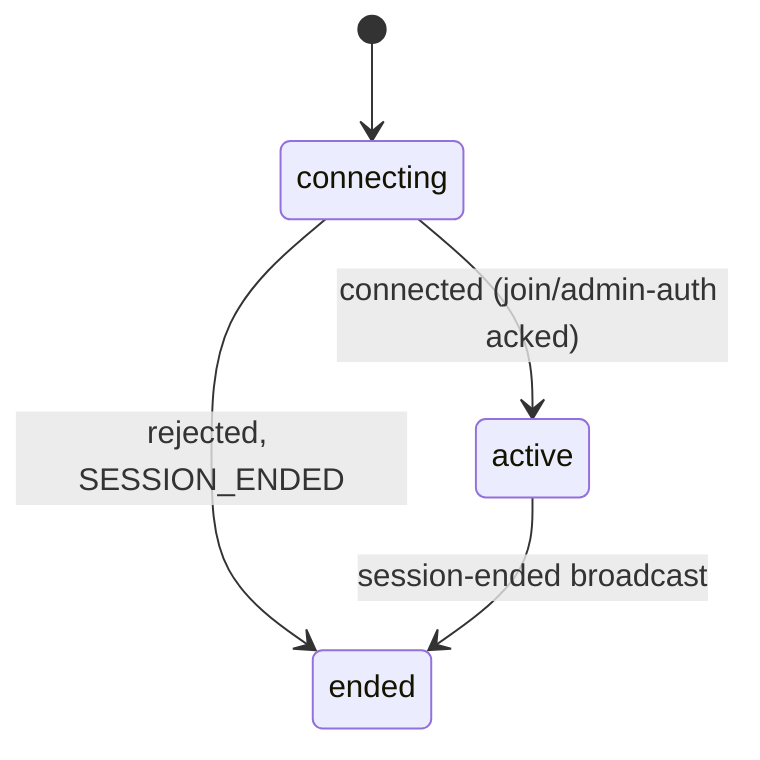

# Estimator Frontend — Implementation Plan

## Context

`estimator-plan.md` (same folder) fully specifies the product, architecture, and every resolved decision — this document only covers the frontend's build sequence: what gets built, in what order, and why. The sibling `estimator-backend/PLAN.md` follows the same format and is already fully built (4 steps, all shipped).

**Deliberately out of scope**: deployment config (`vercel.json`, env vars, CORS bootstrap ordering) — that's a separate pass once both apps are ready to ship together, same as the backend scoped `render.yaml` out of its own `PLAN.md`.

## State management approach

### Why a plain reducer, not a state-machine library

This went through a real back-and-forth worth recording, not just the conclusion — and the deciding factor is readability and clear scoping of intent, not how much code either option produces. A smaller solution that's confusing about what each piece is for isn't better than a larger one where every piece's job is obvious; the two options here happened to differ in size too, but that's incidental, not the reason one won.

Early on, this app's session lifecycle (loading, joining, actively voting, ended) looked like a natural fit for a state-chart library — a fixed, predictable set of statuses is exactly what something like XState is built for, and the appeal was real: named states for things that were previously invisible (an in-flight join, an in-flight admin authentication), and transitions that can't accidentally fire from the wrong state. That appeal hasn't gone away — it's *why* the replacement below is still a state machine (see next section): named states, a fixed set of valid transitions, nothing implicit. What's being dropped is the library, not that thinking.

Building it out surfaced *why* XState specifically stopped being the right fit — a scoping mismatch, not a size one. An XState actor's lifetime is designed to match a component's lifetime; this app's routing needs a live connection to survive a navigation from `/:sessionId/join` to `/:sessionId/start` without being torn down (re-joining on that navigation would create a duplicate participant, decision #7). Reconciling that meant introducing pieces whose entire job was accommodating the library's assumption rather than modeling anything this app's domain actually needed — `provide()`-wired navigation actions, an actor registry keyed for exactly this workaround. The tell was that `sessionMachine.ts`, meant to be pure domain logic, ended up with states named after *routes* and entry actions named `navigateToJoin` — its own definition stopped being obviously scoped to "what is the session's status" and started being partly about "what should the URL do about it," which is precisely the kind of blurred responsibility this whole document has been keeping out of every other piece (see `separate-views-from-routing`). That's the actual problem: not that it was more code, but that a reader of the machine file could no longer tell its job from its name alone.

A reducer avoids that mismatch structurally, not just by being shorter: it's a plain function with no assumption about lifetime at all, so wrapping it in a small external store (subscribe/notify, nothing else) to let it survive a route change is an ordinary, expected thing to do with a plain function — not a workaround bolted onto a library's model. Each piece keeps one obvious job: the reducer only ever computes the next state, the store only ever holds and broadcasts it. Route `loader`s (below) took over the one-time entry checks (does this session exist, is it already ended, is there an admin token) that don't need live tracking at all, which is also a scoping win independent of the reducer choice — it means the reducer's own job is limited to exactly what's still live after a page has settled: is the socket connecting or connected, what's this participant's own selection, is there an error to show. Nothing in it has to explain itself by reference to a library's internal model.

No global store (Redux/Context) and no data-fetching library (TanStack Query) — one small hook per concern instead: `useSession` (below) and `useAdminToken` (Phase 2).

**Why not TanStack Query**: it earns its keep on caching/dedup/refetch across multiple call sites. This app has exactly one `GET /sessions/:id` call site, and every state change after that arrives over the WebSocket, not a refetch — there's no cache to get a return on.

**Why not a global store**, weighed against one hook per concern:

| | One hook per concern | Global store (Context/Redux) |
|---|---|---|
| Pros | No new dependency; each hook is unit-testable alone, no provider needed; a state change only re-renders the tree that called the hook | One shared live instance reachable from anywhere; survives navigation without re-fetching |
| Cons | If a second page ever needs the *same live instance* (not just the same pattern), the hook has to be lifted to a common ancestor | Boilerplate today for a store with exactly one real section and one reader; tempts stuffing unrelated concerns in later; tests need the provider even for unrelated state |

Decision: one hook per concern. `CreateSessionPage` and the session routes below share no live state via React — the only cross-page fact, the admin token, is already centralized in `localStorage` via `useAdminToken`.

### Routes encode session state; route loaders own the one-time checks

A session's status (needs a name, actively voting, ended, doesn't exist) is not an incidental rendering detail — it's exactly the kind of thing a user might bookmark, refresh into, or be sent a link to independently (see the `separate-views-from-routing` skill, `.claude/skills/`, written from this decision). So each status gets a real route, and no component anywhere contains a `switch`/lookup mapping status to screen:

- `/:sessionId/join` — `JoinSessionPage`, name entry, pre-identity.
- `/:sessionId/start` — `ActiveSessionPage`, the interactive grid, for anyone (participant or admin) who already has an identity.
- `/:sessionId/ended` — `EndedPage`, the reveal.
- `/not-found` — `NotFoundPage`, reached from a router-level catch-all *and* from any of the three routes above when the `sessionId` doesn't match a real session — wholesale, regardless of which of `join`/`start`/`ended` was requested. A dead `sessionId` never renders anything except this, no matter which suffix it's paired with.

These stay fully flat, independent top-level routes — no shared parent/layout route. `CreateSessionPage`'s `POST /sessions` response already tells it which one to send the creating admin to (`/:sessionId/start` — they already have an identity, no need to detour through `/join`); `ShareLink` (Phase 8) hands everyone else `/:sessionId/join`, the generic entry point.

Built on React Router's data-router API (`createBrowserRouter`/`RouterProvider`, Phase 0), not `<BrowserRouter>`/`<Routes>` — each route's `loader` does the check that only needs to happen once, at entry, and `redirect()`s directly, with no component ever mounting for the wrong status:

- **`/join`'s loader**: admin token found (`useAdminToken`'s underlying storage read — not the hook itself, loaders aren't components) → `redirect` to `/start`. Otherwise `getSession()` → unknown → `redirect` to `/not-found`; already ended → `redirect` to `/ended`. Otherwise render the form.
- **`/ended`'s loader**: `getSession()` → unknown → `/not-found`; not actually ended yet → `redirect` to `/start` (admin token present) or `/join` (no token). Otherwise returns the reveal payload directly via `useLoaderData()` — `EndedPage` never touches a live connection at all, matching the hybrid REST+WS model's own rule that an ended session needs no socket.
- **`/start`'s loader**: allowed to render if an admin token exists, *or* a live connection already exists for this `sessionId` (see the registry below — meaning `/join`'s submit just created one). Otherwise `getSession()` for the same not-found/already-ended checks, and if the session is genuinely open but there's no identity yet, `redirect` to `/join` — there's nothing valid to render.
- **The catch-all route** (`path: '*'`) redirects to `/not-found` for anything matching neither `/` nor a session route.

What a `loader` *can't* cover is `/start`'s one remaining live concern — a `session-ended` broadcast arriving while already mounted there, since loaders only run once, on entry. That's the one place a small `useEffect` still watches after mount (shown below), not an app-wide sync mechanism.

**The reducer**: `src/lib/sessionConnectionReducer.ts` is a plain function, no React or router import — the state-machine thinking (named states, a fixed set of valid transitions) carried over from the XState version, just not through a library:

```ts
// const added to src/constants.ts, alongside PointSystemType
export const SessionConnectionStatus = { CONNECTING: 'connecting', ACTIVE: 'active', ENDED: 'ended' } as const;
```

```ts
// type added to src/types/constants.ts, alongside PointSystemType's type
import { SessionConnectionStatus } from '../constants';
export type SessionConnectionStatus = (typeof SessionConnectionStatus)[keyof typeof SessionConnectionStatus];
```

```ts
// src/types/session.ts (Phase 2's split applies here too — no derived type inline with the reducer's own logic)
type SessionConnectionState =
  | { status: typeof SessionConnectionStatus.CONNECTING }
  | { status: typeof SessionConnectionStatus.ACTIVE; pointSystem: PointSystem; selection: Selection | null; error: string | null; isAdmin: boolean }
  | { status: typeof SessionConnectionStatus.ENDED };

type SessionConnectionAction =
  | { type: 'connected'; pointSystem: PointSystem; selection: Selection | null; isAdmin: boolean }
  | { type: 'selectionAcked'; selection: Selection | null }
  | { type: 'errorReceived'; message: string }
  | { type: 'sessionEnded' };

function sessionConnectionReducer(state: SessionConnectionState, action: SessionConnectionAction): SessionConnectionState;
```



Deliberately small — `loading`/`notFound`/`join`-as-a-status don't appear here at all anymore, because the loaders above already resolved them before this reducer's owner ever mounts. This is the entire live scope left: was the connection just established, is it active, has it ended.

**The reducer still needs to live outside any one component**, for the same reason as before — the connection established by `/join`'s submit has to survive the navigation to `/start` (re-joining there would create a duplicate participant, decision #7). A plain reducer doesn't assume a component-scoped lifetime the way an actor does, so making it survive a route change is just wrapping it in a small store — not a workaround, just what any external, subscribable piece of state normally needs:

```ts
// src/lib/sessionConnectionRegistry.ts
interface SessionConnectionStore {
  getSnapshot: () => SessionConnectionState;
  subscribe: (listener: () => void) => () => void;
  select: (time: number, resource: number) => void;
  endSession: () => void;
}

const registry = new Map<string, SessionConnectionStore>();

export function getOrCreateSessionConnection(
  sessionId: string,
  identity: { name: string } | { adminToken: string }
): SessionConnectionStore {
  let store = registry.get(sessionId);
  if (!store) {
    store = createSessionConnectionStore(sessionId, identity); // opens the socket, dispatches into the reducer per event, notifies subscribers
    registry.set(sessionId, store);
  }
  return store;
}

export function peekSessionConnection(sessionId: string): SessionConnectionStore | undefined {
  return registry.get(sessionId);
}
```

`getOrCreateSessionConnection` is only ever called directly with a `name` from `JoinSessionPage`'s submit handler — a one-shot mutating action (the one legitimate place a *new* join happens), not a reactive read, so it stays a plain function call there rather than living inside a hook. `peekSessionConnection` is called directly from `/start`'s own loader (Phase 4), which can't use hooks at all.

**`src/hooks/useSession.ts`** is the one place that combines the two into a read — it takes an optional `adminToken` and internally decides `getOrCreateSessionConnection` vs. `peekSessionConnection`, so `ActiveSessionPage` never has to make that decision itself:

```ts
function useSession(sessionId: string, adminToken: string | undefined): SessionConnectionState {
  const store = adminToken
    ? getOrCreateSessionConnection(sessionId, { adminToken })
    : peekSessionConnection(sessionId)!; // guaranteed to exist — the loader only allows entry if it does

  const [state, setState] = useState(() => store.getSnapshot());
  useEffect(() => {
    setState(store.getSnapshot()); // re-sync in case it changed between render and this effect running
    return store.subscribe(() => setState(store.getSnapshot()));
  }, [store]);

  return state;
}
```

A plain `useState`/`useEffect` subscription, not `useSyncExternalStore` — accepting the one known trade-off that comes with it: under concurrent rendering, this pattern can briefly render a stale snapshot before the effect fires, which `useSyncExternalStore` specifically prevents. For a single-tab app with no concurrent-rendering features in play anywhere else in this plan, that gap is unlikely to ever surface — same accepted-risk category as decision #22's unhardened WS races, named rather than silently taken.

```tsx
function ActiveSessionPage() {
  const { sessionId } = useParams();
  const navigate = useNavigate();
  const state = useSession(sessionId!, getAdminToken(sessionId!));

  useEffect(() => {
    if (state.status === SessionConnectionStatus.ENDED) navigate(`/${sessionId}/ended`, { replace: true });
  }, [state.status, sessionId]);

  if (state.status === SessionConnectionStatus.CONNECTING) return <Loader />;
  // real content, using state
}
```

`selection` only ever updates from a server acknowledgement (`joined` / `admin-acknowledged` / `selection-acknowledged`), never optimistically on click — keeps state always equal to server truth, with nothing to roll back for the stale-click-during-end-session race (decision #13).

## Local development

Two dev servers, run concurrently, each in its own terminal. Steps, in order:

1. **Install backend deps** (once): `cd estimator-backend && npm install` — skip if `node_modules` already exists there.
2. **Start the backend**: `npm run dev` in `estimator-backend/` — port 3001, already configured with `CORS_ORIGIN=http://localhost:5173`, no changes needed. Required from Phase 3 onward; not needed for Phases 0–2. Leave it running continuously from Phase 3 through Phase 8 — including Phase 5, which doesn't itself call the backend but isn't worth stopping the server for.
3. **Install frontend deps** (once, after Phase 0's scaffold exists): `npm install` in this repo.
4. **Create `.env.local`** (once, in Phase 2 when `lib/api.ts` starts reading it):
   ```
   VITE_API_BASE_URL=http://localhost:3001
   VITE_SOCKET_URL=http://localhost:3001
   ```
5. **Start the frontend**: `npm run dev` — Vite's default port 5173, left at that default rather than reassigned, so it matches the backend's `CORS_ORIGIN` with no extra config either side.
6. **Open** `http://localhost:5173` in a browser.

---

## Phase 0 — Scaffold

`npm create vite@latest . -- --template react-ts`, then bump React to v19 and add `react-router`. Base `main.tsx` / `App.tsx` on React Router's data-router API (`createBrowserRouter` + `<RouterProvider>`), not `<BrowserRouter>`/`<Routes>` — needed for route `loader`s (see "State management approach"). An empty route array for now. No product logic yet — the goal is a dev server that runs.

```
src/main.tsx
src/App.tsx
```

---

## Phase 1 — Tailwind + shadcn/ui

`npx shadcn@latest init` — sets up Tailwind, `components.json`, and `src/lib/utils.ts` (the `cn()` helper). Then:

```
npx shadcn@latest add button input slider radio-group badge alert-dialog
```

Each primitive lands as editable source in `src/components/ui/`, not an opaque dependency — this is why `shadcn` was chosen over a component library (see `estimator-plan.md`, Frontend section).

---

## Phase 2 — Shared types + API client

`src/constants.ts` — the one dedicated home for every const object that replaces a magic string anywhere in this codebase (see the `no-magic-strings` skill). Values only, nothing else — no derived type declared alongside it here:

```ts
export const PointSystemType = { NUMERICAL: 'numerical', FIBONACCI: 'fibonacci' } as const;
```

`src/types/constants.ts` holds the *type* derived from each of those, kept separate from the const objects themselves — types are centralized in `src/types/` the same as everything else non-prop (see below), and a const's runtime value and its derived compile-time type are two different things, so they don't share a file just because one is computed from the other:

```ts
// src/types/constants.ts
import { PointSystemType } from '../constants';

export type PointSystemType = (typeof PointSystemType)[keyof typeof PointSystemType];
```

(TypeScript keeps the value import and the type declaration from colliding despite the identical name — values and types live in separate namespaces.) `PointSystemType` mirrors the backend's own `src/types.ts` shape (const object, derived type), just split across two files here and with ALL-CAPS keys — a frontend-only convention preference, not something being retrofitted onto the already-shipped backend. `SessionConnectionStatus` (Phase 6) and `GridMode` (Phase 5) both get their const added to `constants.ts` and their type added to `types/constants.ts` as they're introduced, rather than each living next to whatever first needed it.

`src/types/` — every non-prop type in this codebase, centralized the same way `src/constants.ts` centralizes const objects; component prop types are the one exception (they stay local to their component file — see Phase 5). `src/types/protocol.ts` is hand-duplicated from the backend's `src/types.ts`, with a comment pointing at its counterpart — small enough (~6 message types) that a shared package would be overkill. Imports the `PointSystemType` type from `./constants` (same folder, not the root-level `../constants`, which only has the value):

```ts
// src/types/protocol.ts
import type { PointSystemType } from './constants';

export interface PointSystem { type: PointSystemType; sliderMax: number; axisValues: number[] }
export interface Selection { time: number; resource: number }
export interface RevealPayload { squares: { time: number; resource: number; names: string[] }[]; abstained: string[] }
```

`src/types/session.ts` (added in Phase 6, alongside the reducer) holds `SessionConnectionState`/`SessionConnectionAction` and any other type describing the connection's shape — kept separate from `protocol.ts` since it's a frontend-only concept, not one mirrored from the backend.

`src/lib/api.ts` — thin fetch wrappers:

```ts
export function createSession(input: { adminName: string; pointSystemType: string; sliderMax: number }): Promise<CreateSessionResponse>;
export function getSession(sessionId: string): Promise<GetSessionResponse>;
```

`src/hooks/useAdminToken.ts` — localStorage get/set/remove, keyed `estimator:adminToken:<sessionId>` (decision on admin auth in `estimator-plan.md`). Side effects live in the hook, not scattered across components.

---

## Phase 3 — Create-session flow

From this phase onward, the frontend talks to a real backend — run `npm run dev` in `estimator-backend/` in the background before starting. No extra config needed: it defaults to port 3001 with `CORS_ORIGIN=http://localhost:5173`, matching Vite's default port. Leave it running continuously through Phase 8 — Phases 0–2 don't call it, but Phase 5 onward all do, so it's simplest not to stop it in between.

`src/routes/CreateSessionPage.tsx` — heading "Create a new session" (per wireframe), a name field, and two shadcn-built components:

- `PointSystemPicker` — `RadioGroup`, numerical vs. fibonacci.
- `RangeSlider` — `Slider`, min/max swaps (0–20 vs 0–64) when the point system changes, and the value **resets to 0** on every switch — deliberate, forces a conscious re-pick rather than silently inheriting the old max.

Submit button reads **"Start Session"** (per wireframe). On submit: `POST /sessions` via `lib/api.ts`, store the returned `adminToken` via `useAdminToken`, navigate straight to `/:sessionId/start` — the creating admin already has an identity, no need to detour through `/join`.

---

## Phase 4 — Routing shell + loaders

The real route table, via `createBrowserRouter` in `App.tsx`, all flat (no nesting — see "State management approach" above):

```tsx
createBrowserRouter([
  { path: '/', element: <CreateSessionPage /> },
  { path: '/:sessionId/join', element: <JoinSessionPage />, loader: joinLoader },
  { path: '/:sessionId/start', element: <ActiveSessionPage />, loader: startLoader },
  { path: '/:sessionId/ended', element: <EndedPage />, loader: endedLoader },
  { path: '/not-found', element: <NotFoundPage /> },
  { path: '*', loader: () => redirect('/not-found') },
]);
```

`src/routes/loaders.ts` (v1) — `joinLoader`, `startLoader`, `endedLoader`, exactly as described in "State management approach": each does its own not-found/already-ended/admin-token checks via `getSession()` and the admin-token storage read, `redirect()`-ing directly rather than rendering a wrong-status page. No actor, no reducer, no socket touched by any of them yet.

`src/routes/JoinSessionPage.tsx`, `ActiveSessionPage.tsx`, `EndedPage.tsx`, `NotFoundPage.tsx` — minimal placeholder content for now (each renders a stub, relying entirely on its `loader` to prove the redirect logic), enough to confirm the routing/guard behavior works end-to-end before any real UI or realtime complexity is added.

---

## Phase 5 — EstimationGrid (static)

`src/components/EstimationGrid.tsx` — the one hand-built component, since no shadcn primitive models a data-driven NxN grid. Built here in isolation (hardcoded `axisValues` prop, no live data) so its layout — Tailwind utilities + inline `style` for dynamic `grid-template-columns/rows` — is solid before wiring in real interactivity.

```ts
// const added to src/constants.ts, alongside PointSystemType and SessionConnectionStatus
export const GridMode = { INTERACTIVE: 'interactive', READONLY: 'readonly' } as const;
```

```ts
// type added to src/types/constants.ts
import { GridMode } from '../constants';
export type GridMode = (typeof GridMode)[keyof typeof GridMode];
```

```ts
// src/components/EstimationGrid.tsx — prop types stay local (Phase 2's exception), but GridMode
// itself is still imported from the centralized types file, not redeclared here
import type { GridMode } from '../types/constants';

interface EstimationGridProps {
  axisValues: number[];
  mode: GridMode;
  selection?: Selection | null;
  reveal?: RevealPayload;
  onSelect?: (selection: Selection) => void;
}
```

Click/tap only, no keyboard nav (decision #18).

---

## Phase 6 — `sessionConnectionReducer` (join slice) + `JoinSessionPage`

`src/lib/sessionConnectionRegistry.ts`'s `createSessionConnectionStore` (v1) — opens the Socket.IO client lifecycle via `socket.io-client`:

```ts
io(socketUrl, { reconnection: false, query: { sessionId } });
```

`reconnection: false` is deliberate — a network blip should re-prompt for a name, not silently resume (matches "always fresh join"). The reducer's `active` state gains the `error` field, consumed by `ErrorBanner`. The socket only opens when `getOrCreateSessionConnection` is first called with a `{ name }` identity — i.e. on `/join`'s submit, not on mount, and not for a plain status check.

`src/routes/JoinSessionPage.tsx` — real content now: heading "Join a session" (per wireframe), `Input` + `Button` ("Enter Session"), inline validation error text. On submit: `getOrCreateSessionConnection(sessionId, { name })`, wait for the resulting store's state to leave `CONNECTING`, then `navigate('/:sessionId/start')` on success or stay put with the store's `error` shown if the join itself was rejected. This is the one place a *new* connection is ever created with a name.

`src/components/ActiveSessionView.tsx` — the presentational content `ActiveSessionPage.tsx` renders once its `useSession` state leaves `CONNECTING`: one view for both a plain participant and an admin (not two separate components — `estimator-plan.md`'s own design treats admin as a participant plus one added capability, and the Miro review found the admin's screen is the same grid with an "End session" button in its header, not a different screen). Renders `EstimationGrid` (interactive mode) wired to the state's `select` action, plus `ErrorBanner`. Takes an optional `endSession`: absent for a plain participant, present for an admin (Phase 7).

`src/components/ErrorBanner.tsx` — custom dismissible banner (not shadcn `toast`/`sonner`, decision #13), mounted inside `ActiveSessionView`, not `ActiveSessionPage` or any other route — it's the only place the state's `error` field is meant to surface.

---

## Phase 7 — `sessionConnectionReducer` (admin slice)

`ActiveSessionPage` extended: when `getAdminToken(sessionId)` finds a stored token, it calls `getOrCreateSessionConnection(sessionId, { adminToken })` instead of relying on `peekSessionConnection` — the store's underlying socket sends `admin-auth` instead of `join`. The ack includes the admin's current `selection` (decision #19) — this is what makes a second tab, or a plain refresh, show the real vote instead of a blank grid. State now carries `isAdmin: true`, and `ActiveSessionView` passes `endSession` through only in that case.

`src/components/AdminControls.tsx` — `Button` + `AlertDialog` (confirm before ending — irreversible). On confirm, calls `endSession()`. `ActiveSessionView` (Phase 6) renders this only when passed an `endSession` prop — i.e. only for an admin identity, no separate admin view file needed.

A `session-ended` broadcast dispatches `sessionEnded` into the reducer, moving state to `ENDED` regardless of which browser or identity received it — the `useEffect` in `ActiveSessionPage` (already shown in "State management approach," built in Phase 6 alongside the rest of its real content) is what actually navigates that browser to `/:sessionId/ended` once it sees that status; no separate navigation logic needed here. A second `end-session` (double-click, two tabs) is a silent no-op (decision #21) — no `ErrorBanner`.

---

## Phase 8 — Reveal + polish

`src/routes/EndedPage.tsx` gets its real content, wiring up the pieces left as placeholders:

- `EstimationGrid` readonly mode — renders each square's voter names from `reveal`; squares with many names wrap/truncate with a `+N more` affordance (not otherwise specified, called out explicitly as a build requirement).
- `AbstainedList` — `Badge` per name, flex-wrapped.
- `SessionStatusHeader` — `Badge` ("In Progress" / "Ended").
- `ShareLink` — readonly `Input` + copy-to-clipboard `Button`, displaying `/:sessionId/join` — the generic entry point, not `/start` (which only makes sense for someone who already has an identity).
- "Create new session" button (found during Miro wireframe review, not in the original Notion spec) — navigates back to `/`, no state carried over.

This is the last phase — after this, all three session routes are fully real, not placeholders.

---

## Sequencing

1. Phase 0 before everything (nothing else has a project to live in) — including the data-router setup, since loaders depend on it.
2. Phase 1 before any component work (every component is shadcn-styled).
3. Phase 2 before Phases 3–4 (both need `types.ts` and `lib/api.ts`).
4. Phase 4's loaders before Phase 6 — the reducer/registry/`useSession` only ever get reached once a loader has already confirmed the route is valid to render.
5. Phase 5 (`EstimationGrid`) before Phase 6 (Phase 6 wires real data into it).
6. Phases 6 → 7 grow the same `sessionConnectionReducer`/`sessionConnectionRegistry.ts` in place — join slice, then admin slice. `useSession.ts`, built in Phase 6, doesn't change shape after that.
7. Phase 8 last — it fills in `EndedPage`'s rendering, the one route still a placeholder after Phase 7.

## Critical files

- `src/routes/loaders.ts` — every session route's one-time entry guard (not-found, already-ended, wrong-identity); the reason no page ever mounts for the wrong status in the first place.
- `src/lib/sessionConnectionReducer.ts` — owns the entire live socket lifecycle once a page has been allowed to render; zero React or router imports, testable standalone (see "State management approach" above).
- `src/lib/sessionConnectionRegistry.ts` — what lets the connection survive a `/join` → `/start` navigation despite the routes being fully flat, with no shared parent route.
- `src/hooks/useSession.ts` — the plain read `ActiveSessionPage` uses to render its content and to know when to navigate itself to `/ended`.
- `src/components/EstimationGrid.tsx` — the one hand-built, data-driven component.
- `src/types/protocol.ts` — must stay in sync with the backend's `src/types.ts`.
