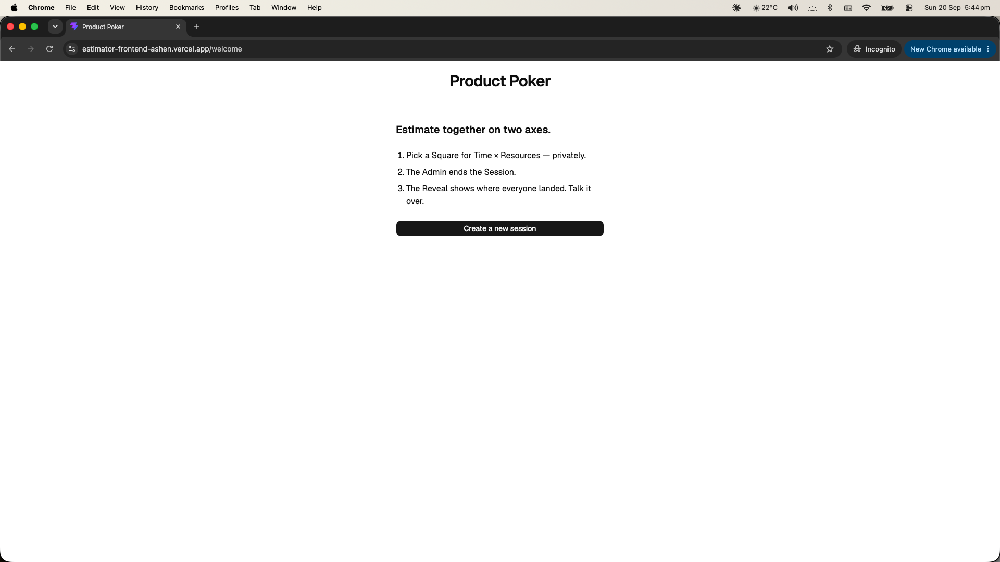
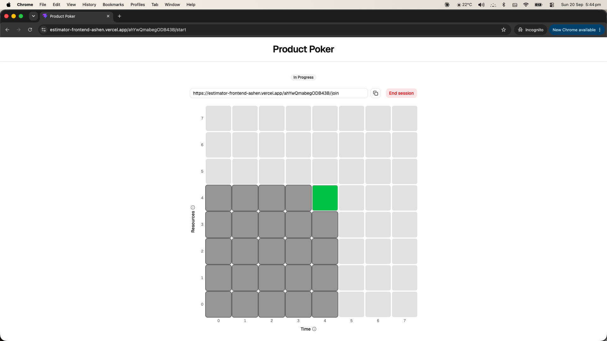
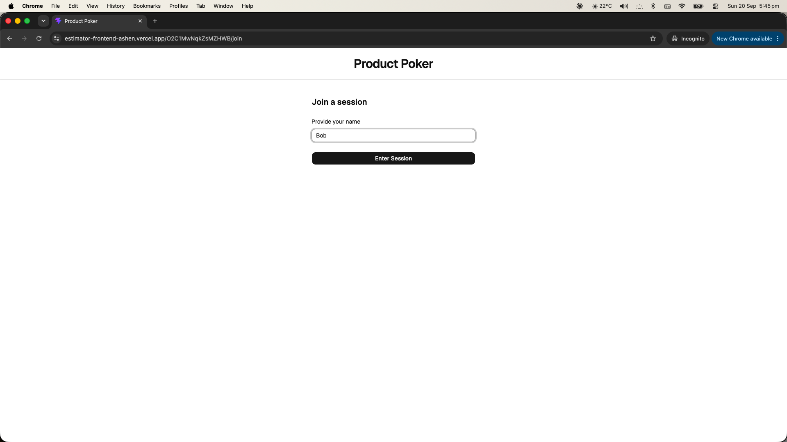

# Jira Poker frontend

[](https://estimator-frontend-ashen.vercel.app/)

## Installation

You will require a local `.env` file with below variables:

```
VITE_API_BASE_URL=http://localhost:3001
VITE_SOCKET_URL=http://localhost:3001
```

For running a local instance on your machine:

```
npm install
npm run dev // runs on localhost:5173

```

## Description

This is the front-end React component to a full stack application that allows users to create sessions (stored on server side) to contribute to point-sizing a piece of work in a "blind-poker" style. This project was Claude Code assisted to explore the potential and functionalities it can offer, and how I can integrate it into my own thinking and workflows. Worth exploring would be

- PLAN.md
- CONTEXT.md
- under /docs, Architecture Decision Records, feature documentation, deployment plans

I used spec-driven development with Claude Code. The resources that I used included:

- Matt Pocock grilling skills
- adapted `agent.md` from Fabien Saglard's version[https://fabiensanglard.net/agent.md/]
- Claude design skills
- impeccable and intent skills for design exploration

The estimator-plan.md was the original product plan that used MCPs to pull data from a [Notion doc](https://app.notion.com/p/rachelwong/Estimator-3bb375d34b3480548d26edd98dcc8a11?source=copy_link) and a [Miro board](https://miro.com/welcomeonboard/M3IrMjlGUzNFVDg1SXNtY2RVLzIvVDdkVUpsOUg0L1JPSVV4YTF3YThqaFJrR3pJcmdMellnK1ltcHlab3dMc1JDY0pNaVkwdTVKTElOY0NTa2wrZDVIanN5YVJXV1ZnekExWnB3elh0WFBDaVZSZUc4SkdXb0VBdEY5NkQ2YmZ0R2lncW1vRmFBVnlLcVJzTmdFdlNRPT0hdjE=?share_link_id=721456564705).

### Screenshots

<table align="center">
  <!-- First Row of Images -->
  <tr>
    <td align="center">
      <b>Welcome screen</b><br>
      
    </td>
    <td align="center">
      <b>Create Session</b><br>
      
    </td>
    <td align="center">
      <b>Active Session</b><br>
      
    </td>
  </tr>
  <!-- Second Row of Images -->
  <tr>
    <td align="center">
      <b>Join Session</b><br>
      
    </td>
    <td align="center">
      <b>Active to end session</b><br>
      
    </td>
    <td align="center">
      <b>End Session</b><br>
      
    </td>
  </tr>
</table>

## Features & Tech Stack

### Features

### Tech stack

- Vercel deployment for one-click ease and free tier
- React, Typescript, Vite as bread and butter
- TailwindCSS: opportunity to learn
- WebSockets by bidirectional traffic flow

## Key learnings

> TL;DR I haven't yet fully moved over to the AI-way of doing things yet. AI-assisted coding is perhaps not as fast as I thought it would be, but certainly faster than me. I'm deliberatly slowing it down for code quality and edge case testing's sake.

- managing documentation drift: monorepo approach would be better to house both front and backend
- managing usage limits: I'm currently on the lowest Claude Code Pro plan. So this [reddit advice](https://www.reddit.com/r/ClaudeAI/comments/1u7i5ow/pro_tip_reset_your_usage_limits_on_your_schedule/) is relevant: create a Claude Code Routine that runs daily, use Haiku, and just say something like "Hello, just respond with "hello"", 5 hours before you want your usage to reset
- Plan mode x grilling skills x human code review
- configuring memory.md and agents.md brings better quality and _succinct_ responses. I have found wading through paragraphs of text describing code to be a productivity tax to using something that's meant to accelerate it :shrug.
- having front-end experience means I can provide better directions to Claude
- Plan mode and break out the work into phases. Manually review each phase and manually commit is my preferred way to go at the moment, until I can find a way to confidently gatekeep quality.
- This is a fairly lightweight app with no global context, redux store and yet upon first completing all the implementation phases, the bundling size went over the 500kb Vite alert. I resolved this by lazy-loading in specific pages, and pulling down the `TooltipProvider` and `cv` from shadcn further down the component tree to only when it is being used (i.e. EstimationGrid). This was a manual call-out which Claude did not pick up at all.
- Burned a lot of time discussing best state management techniques. We cycled through global context, reducers, state machine, local providers before we landed on current arrangement. Prompting for 'best practice' is not the strongest guarantee.
- now that markdown documentation generation is a thing, have hidden vercel build paths to `.md` files
- Skills: key things that I have asked Claude Code to do in terms of code conventions include:
  - avoid magic strings/numbers
  - one component per file
  - utils, functions, types, constants live in their own respective folders
  - use barrel files
  - lean towards plain english naming convention, don't abbreviate (i.e. why `Ws` when you can `Websocket`)
  - separation of concerns wherever possible
  - picking up on Claude over-engineering solutions (i.e complex hash-sort method to randomise picking colours for participant names is overkill)

## Roadmap

### Features

From feature perspective, this has been a great sandbox to try out Claude Code without constraints. Other ideas include:

[ ] adding a notes feature to allow participants to share more details beyond just their points selection
[ ] allowing participants to be anonymous. They can provide a name still, but their names could be hidden from other participants, and only the session creator (admin) can see all the names in full.
[ ] add a theme provider to toggle between fun and work visual modes for different team environments. A bit like [OpenJev](https://openjev.com/) but less obviously AI-slop.

### AI

For AI, the next things I want to try out more is

- start with [impeccable](https://impeccable.style/) or intent-driven development first to generate a product document
- AI-assisted Automated testing tools to capture all the edge cases with sessions
