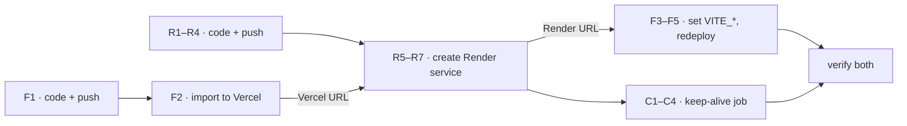

# Deployment — Plan

First deploy. Backend → Render, frontend → Vercel, both free tier, both
push-to-deploy, no CI gate (decision #17). A cron-job.org ping keeps Render
awake. Rachel does every dashboard step.

Three checklists below: **backend** (R), **frontend** (F) and **keep-alive**
(C). They interleave, because each side needs the other's URL:

| # | Do | Hands over |
| --- | --- | --- |
| 1 | Both repos: code changes, local checks, push (R1–R4, F1) | — |
| 2 | Import the frontend to Vercel (F2) | the Vercel URL |
| 3 | Create the Render service, `CORS_ORIGIN` = that URL (R5–R7) | the Render URL |
| 4 | Set the frontend's `VITE_*` vars to it, redeploy (F3–F5) | — |
| 5 | Create the keep-alive job (C1–C4) | — |
| 6 | Verify: R8–R9, F6–F13, C5–C6 | — |



Both URLs follow the project name (`<project>.vercel.app`,
`<service>.onrender.com`), so they're predictable — but confirm, don't assume,
in case a name was taken.

Why each value exists is in `estimator-plan.md` → "Deployment" and "Secrets &
environment configuration". Not repeated here.

**This file is mirrored in both repos** — `estimator-frontend/docs/plans/deployment.md`
and `estimator-backend/DEPLOYMENT.md` — because a deploy touches both and
neither repo owns the sequence. Edit both, or they drift.

---

## Backend checklist — Render

**Code** (`estimator-backend/`)

- [ ] R1. Add `render.yaml`:
      ```yaml
      services:
        - type: web
          name: estimator-backend
          runtime: node
          plan: free
          buildCommand: npm ci --include=dev && npm run build
          startCommand: npm run start
          healthCheckPath: /healthz
          autoDeploy: true
          envVars:
            - key: NODE_ENV
              value: production
            - key: CORS_ORIGIN
              sync: false # typed into the dashboard at R5
      ```
      No other code change. `/healthz`, the single-port `http.Server`, the
      `PORT` binding and the production `CORS_ORIGIN` checks are already there.
- [ ] R2. `npm run typecheck && npm run lint && npm test && npm run build` pass.
- [ ] R3. `NODE_ENV=production CORS_ORIGIN=https://example.com npm start` boots
      and answers `/healthz` — this runs the compiled ESM output, where an
      import problem would first show up. Then check the guard: the same command
      **without** `CORS_ORIGIN` refuses to start.
- [ ] R4. Push to `master`.

**Dashboard** — needs the Vercel URL from F2

- [ ] R5. New → Blueprint → `rachelwong/estimator-backend`. When prompted for
      `CORS_ORIGIN`, paste the Vercel URL: scheme and host, no trailing slash.
- [ ] R6. Wait for the deploy to go live. Note the service URL.
- [ ] R7. Confirm the settings Render picked up from `render.yaml` (see
      Reference → Render). Check the region while you're there — it can't be
      changed later without recreating the service.

**Verify**

- [ ] R8. `curl https://<service>.onrender.com/healthz` returns 200.
- [ ] R9. Render → Logs shows the service listening, with no boot errors.

---

## Frontend checklist — Vercel

**Code** (`estimator-frontend/`)

- [ ] F1a. Add `vercel.json`:
      ```json
      { "rewrites": [{ "source": "/(.*)", "destination": "/index.html" }] }
      ```
      Without it, a refresh or a pasted share link (`/:sessionId/join`) hits
      Vercel's 404 before React Router loads.
- [ ] F1b. `vite.config.ts`: fail a production build when either URL is missing
      or isn't `https://`, so a misconfigured build can't ship
      `undefined/sessions`:
      ```ts
      export default defineConfig(({ command, mode }) => {
        if (command === 'build') {
          const env = loadEnv(mode, process.cwd(), 'VITE_')
          for (const key of ['VITE_API_BASE_URL', 'VITE_SOCKET_URL']) {
            const value = env[key]
            if (!value) throw new Error(`${key} must be set for a build`)
            if (process.env.VERCEL && !value.startsWith('https://'))
              throw new Error(`${key} must be https:// (got ${value})`)
          }
        }
        return { /* existing config */ }
      })
      ```
      The `VERCEL` check keeps a local `npm run build` against
      `http://localhost:3001` working.
- [ ] F1c. `scripts/smoke/lib.mjs`: read `APP` and `API` from `SMOKE_APP_URL`
      and `SMOKE_API_URL`, falling back to today's localhost values. Lets the
      same suite run against production.
- [ ] F1d. `npm run build` and `npm run lint` pass, and the smoke suite passes
      against a local backend — it hasn't been run since the welcome-page commit
      (`docs/plans/ui-refresh.md` verification step 2).
- [ ] F1e. Push to `master`.

**Dashboard, first pass** — do this before R5, it's where the Vercel URL comes from

- [ ] F2a. Add New → Project → import `rachelwong/estimator-frontend`.
- [ ] F2b. Settings → General → Node.js Version: **24.x**, to match the backend
      and local.
- [ ] F2c. Settings → Deployment Protection → Vercel Authentication **off for
      Production** (see Gotchas — this one is invisible to you and breaks every
      share link).
- [ ] F2d. Note the production URL, e.g. `https://estimator-frontend.vercel.app`.
      The first build **fails** on the env check. Expected — hand this URL to R5.

**Dashboard, second pass** — needs the Render URL from R6

- [ ] F3. Settings → Environment Variables, **Production** only:
      `VITE_API_BASE_URL` and `VITE_SOCKET_URL`, both the Render URL, no
      trailing slash.
- [ ] F4. Deployments → Redeploy. `VITE_*` values are compiled into the bundle
      at build time, so saving them does nothing until a new build runs.
- [ ] F5. Confirm the build settings (see Reference → Vercel).

**Verify** — on the production URL, two browser profiles

- [ ] F6. `/` redirects to `/welcome`, header and page render.
- [ ] F7. Create a Session → lands on `/:sessionId/start`. About a second once
      the ping is running; up to 60 seconds while the backend is still asleep.
- [ ] F8. DevTools → Network: requests go to the `onrender.com` host over
      `https`, no CORS errors, and the socket upgrades to `wss://`.
- [ ] F9. Open the share link in a **private window, signed out of Vercel**:
      `/join` loads — not a Vercel 404, not a Vercel login page.
- [ ] F10. Refresh on `/start`: the Admin keeps their Selection.
- [ ] F11. Both profiles pick Squares, Admin ends the Session: both tabs move to
      `/ended` without a refresh, and the Reveal is right.
- [ ] F12. A nonsense session id goes to `/not-found`.
- [ ] F13. Optional: `SMOKE_APP_URL=… SMOKE_API_URL=… npm run smoke` against
      production.

---

## Keep-alive checklist — cron-job.org

Render's free tier sleeps after 15 minutes with no inbound HTTP traffic, and a
socket doesn't count — so a Session in progress can be put to sleep. Pinging
every 10 minutes keeps the gap under 15 even if one ping runs late.

- [ ] C1. Create a job: `GET https://<service>.onrender.com/healthz`, every 10
      minutes (`*/10 * * * *`).
- [ ] C2. Timeout: the maximum allowed. The first ping after a sleep can take
      30–60 seconds.
- [ ] C3. Failure notifications: on. A run of failures means the backend is
      down, not merely asleep.
- [ ] C4. Run the job's test once, and confirm Render → Logs shows the
      `/healthz` request.
- [ ] C5. An hour later: the job's history is all 200s, and Render → Events
      shows no spin-down since the job started.
- [ ] C6. Confirm this is the **only** free Web Service in the Render workspace
      (see Gotchas — free hours).

---

## Reference — settings

`<service>` is the Render service name, `<project>` the Vercel one.

### Render

From `render.yaml`, so confirm rather than retype. Only `CORS_ORIGIN` is typed in.

| Setting | Value |
| --- | --- |
| Service type | Web Service |
| Repository / branch | `rachelwong/estimator-backend`, `master` |
| Region | Closest to the team. Permanent |
| Runtime / instance | Node, Free |
| Build command | `npm ci --include=dev && npm run build` |
| Start command | `npm run start` |
| Health check path | `/healthz` |
| Auto-deploy | On |
| Node version | 24, from `.nvmrc` |

| Env var | Value | Why |
| --- | --- | --- |
| `NODE_ENV` | `production` | Turns on the `CORS_ORIGIN` checks in `loadConfig()` |
| `CORS_ORIGIN` | `https://<project>.vercel.app` | Exact match. No trailing slash, no path, no `*`. Update it if the frontend URL changes |
| `PORT` | **don't set** | Render injects it; `server.ts` binds what it's given |

No secrets: no database, no API keys, and `adminToken` is generated per Session
at runtime. Saving any change restarts the service, wiping Sessions in progress.

### Vercel

| Setting | Value |
| --- | --- |
| Repository / production branch | `rachelwong/estimator-frontend`, `master` |
| Framework preset | Vite (auto-detected) |
| Root directory | `./` |
| Build command | `npm run build` (default for the preset) |
| Output directory | `dist` (auto-detected) |
| Install command | Default |
| Node.js version | 24.x |
| Deployment protection | Off for Production |

| Env var (Production only) | Value | Why |
| --- | --- | --- |
| `VITE_API_BASE_URL` | `https://<service>.onrender.com` | No trailing slash — `lib/api.ts` appends `/sessions` |
| `VITE_SOCKET_URL` | `https://<service>.onrender.com` | Same host. Socket.IO upgrades to `wss://` itself |

Both are compiled into the bundle and visible in devtools. That's fine — they're
URLs, not credentials. Nothing secret can ever go in a `VITE_*` variable.

---

## Gotchas

- **Deployment protection blocks every share link.** With Vercel Authentication
  on for Production, a share link sends the recipient to a Vercel login they
  have no account for — while you, signed in, see the app work perfectly. This
  app has no accounts by design; the link *is* the invitation. Test it in a
  private window, not a second profile you're logged into (F2c, F9).
- **Preview builds fail the env check, on purpose.** The `VITE_*` values are
  Production-only, so previews throw `VITE_API_BASE_URL must be set for a build`.
  A preview that *did* build would load and then fail every request at the
  browser's CORS check, since `CORS_ORIGIN` names only the production domain —
  a slower, more confusing failure. Preview a branch by running both repos
  locally instead.
- **Free hours.** Render gives 750 free instance hours a month per workspace;
  one service kept awake all month uses about 744. A second free Web Service
  kept awake would exhaust the quota mid-month and suspend both (C6).
- **`npm install` on Render skips `tsc`.** With `NODE_ENV=production`, npm omits
  devDependencies, so the build fails. Hence `npm ci --include=dev` (R1).
- **The backend won't start without `CORS_ORIGIN`.** `loadConfig()` throws in
  production, so the URL has to be in hand before the first Render deploy — which
  is why the frontend is imported first (F2 before R5).

---

## Operating notes

- **Any backend deploy wipes every Session.** State is in memory only. Push
  backend changes when nobody is mid-Session.
- **Slow loads or dropped Sessions?** Check the cron job's history first. A
  paused or failing job means Render is sleeping again.
- **Rollback.** Vercel: Deployments → earlier build → Promote to Production.
  Render: Events → earlier deploy → Rollback (also wipes Sessions).
- **Protocol changes.** The frontend's `src/types/protocol.ts` mirrors the
  backend's `src/types.ts` by hand.
  Deploy the backend first when the change is backward-compatible; otherwise
  deploy both together, when nobody is mid-Session.
- **New frontend URL** (rename or custom domain) means updating `CORS_ORIGIN` on
  Render.

---

## Drift from `estimator-plan.md`

| It says | This plan does | Why |
| --- | --- | --- |
| Deploy the backend first, "`CORS_ORIGIN` doesn't matter yet" | Import the frontend first, for its URL | `loadConfig()` throws when it's unset in production, so that deploy would fail its health check |
| `buildCommand: npm install && npm run build` | `npm ci --include=dev && npm run build` | Otherwise `tsc` isn't installed. `npm ci` also honours the lockfile |
| Vercel env vars on Production and Preview | Production only | Preview origins are blocked by CORS anyway |
| Spin-down accepted; create the Session just before the meeting | A 10-minute keep-alive ping | Removes both the cold start and the mid-Session sleep that drops sockets |

## Out of scope

- Custom domain; preview deploys reaching a backend (needs a second allowed
  origin or a staging backend).
- A CI gate; error monitoring. The cron job's failure alerts are the only
  uptime alerting.
- Code-splitting the 517 kB bundle.
